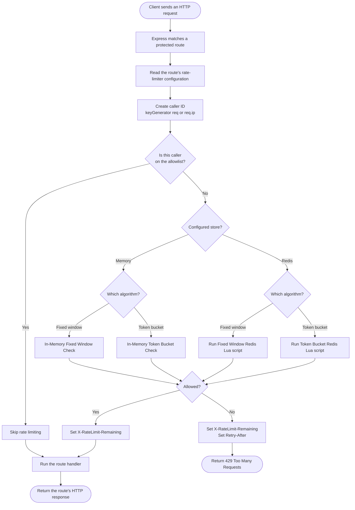

# Rate Limiter Middleware Control Flow Diagram

This diagram shows what happens in the running Express application when a
client calls one of the protected routes (`/login`, `/search`, or `/users`).
It describes the actual implementation in this project; it is not a proposed
future design.

## How it maps to the real routes

| Route     | Algorithm    | Limit configuration                          | Store                |
| --------- | ------------ | -------------------------------------------- | -------------------- |
| `/login`  | Fixed window | 5 requests per 60 seconds                    | Redis                |
| `/search` | Token bucket | Capacity 10; refill rate 0.001 tokens/second | Redis                |
| `/users`  | Fixed window | 20 requests per 60 seconds                   | Memory (the default) |

## What the important branches mean

- **Allowlist branch:** a caller listed through `POST /allowlist/:id` skips the
  limiter and reaches the handler immediately. The ID must match the one made
  by the route's `keyGenerator`.
- **Fixed-window branch:** each caller gets a counter. A request is allowed
  while the counter is no higher than the route limit; the counter resets when
  the window expires.
- **Token-bucket branch:** each caller has tokens up to the configured
  capacity. One token is spent per allowed request; tokens are refilled lazily
  when the next request arrives.
- **Redis branch:** the Lua scripts keep the read, decision, and update
  together atomically, so concurrent requests cannot both claim the same
  remaining request/token.
- **Rejected branch:** the route handler is never called. The client receives
  `429 Too Many Requests`, `Retry-After`, and `X-RateLimit-Remaining: 0`.

## Real-world example

A user sends six `/login` requests from the same `X-Forwarded-For` address in
one minute. Express uses that address as the caller ID, sees that it is not
allowlisted, and selects the fixed-window configuration for `/login`. The first
five requests are atomically counted in Redis and proceed to the login handler.
The sixth request receives `429 Too Many Requests` with the number of seconds
until the current 60-second window resets. A different caller ID has its own
separate counter and allowance.
